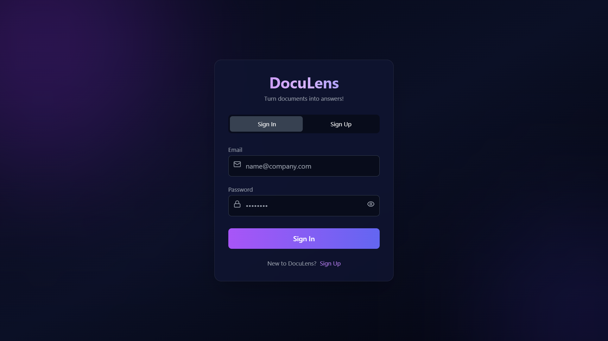
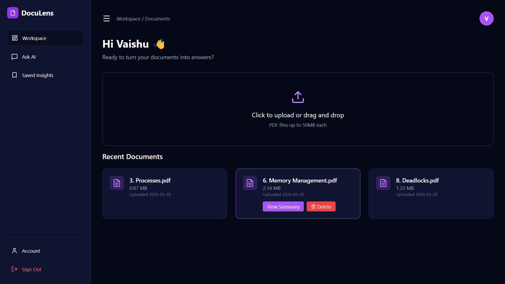
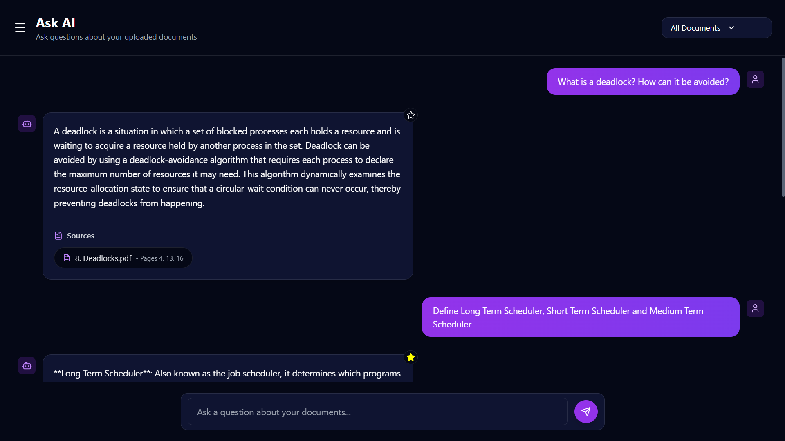
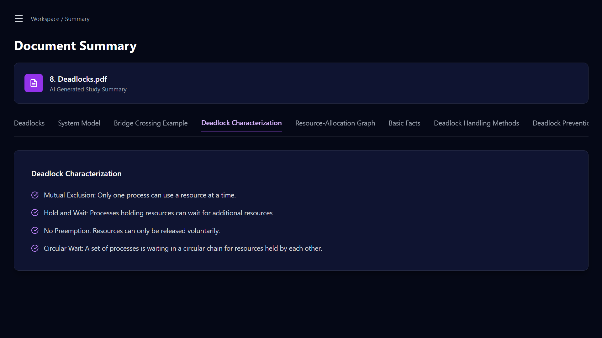
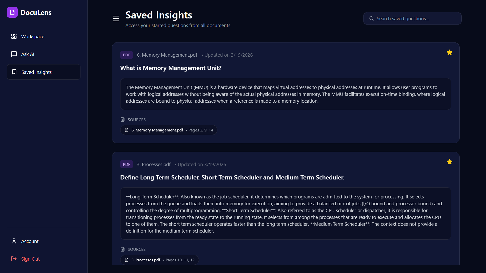
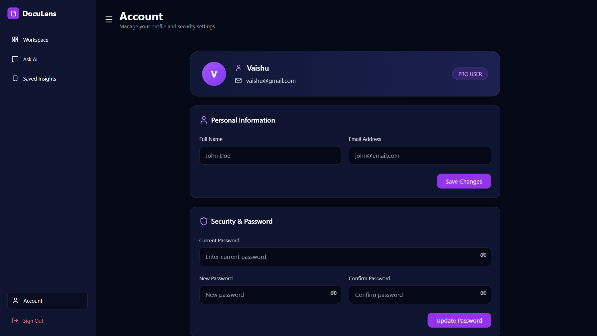

# 🚀 DocuLens – Turn Documents into Answers

> 🧠 An AI-powered document intelligence system that lets you **chat with PDFs**, generate **structured summaries**, and extract **meaningful insights** using Retrieval-Augmented Generation (RAG).

---

## 🌟 What Makes DocuLens Special?

✨ Upload PDFs → Ask Questions → Get Accurate Answers
📑 Smart summaries for exam prep & quick revision
🧠 No hallucination – answers strictly from your documents
💾 Persistent storage for starred insights (SQLite)
⚡ Fast, clean, and modern UI

---

## 🎯 Key Features

* 📂 **Multi-PDF Upload & Processing**
* 💬 **Context-aware Q&A (RAG-based)**
* 📑 **Topic-wise Structured Summaries**
* ⭐ **Star & Save Important Questions**
* 🔐 **User Authentication (JWT)**
* 💾 **SQLite Database for persistence**
* ⚡ **Responsive & Modern UI**

---

## 🧠 How It Works

```text
PDF Upload → Text Extraction → Chunking → Embeddings
→ Stored in Vector DB (ChromaDB)
→ User Query → Relevant Context Retrieved
→ LLM Generates Answer (RAG)
```

---

## 🏗️ Tech Stack

### 💻 Frontend

* ⚛️ React (Vite)
* 🎨 Tailwind CSS
* 🎯 Lucide Icons

### ⚙️ Backend

* ⚡ FastAPI
* 🗄️ SQLAlchemy
* 💾 SQLite (User data & starred insights)
* 🔐 JWT Authentication

### 🤖 AI / ML

* 🧠 LangChain
* 📦 ChromaDB (Vector Store)
* 🔍 Sentence Transformers
* ☁️ Azure OpenAI API

---

## 📸 App Preview

### 🔐 Login Page
<p align="left">
  
</p>

### 📂 Dashboard
<p align="left">
  
</p>
### 💬 Chat Interface
<p align="left">
  
</p>

### 📑 Summary View
<p align="left">
  
</p>

### ⭐ Saved Insights
<p align="left">
  
</p>

### 👤 Account Page
<p align="left">
  
</p>

---

## ⚙️ Setup Guide

### 🔹 Clone Repository

```bash
git clone https://github.com/Vaishnavi02102014/DocuLens---Turn-documents-into-answers.git
cd DocuLens---Turn-documents-into-answers
```

---

### 🔹 Backend Setup

```bash
cd backend
pip install -r requirements.txt
uvicorn app.main:app --reload
```

---

### 🔹 Frontend Setup

```bash
cd frontend
npm install
npm run dev
```

---

## 🔐 Environment Variables

Create a `.env` file inside backend:

```env
GITHUB_TOKEN=your_api_key_here
```

---

## 🚀 Future Improvements

* ☁️ Cloud storage (AWS S3 / Cloudinary)
* 🧠 Multi-document chat
* 📊 Analytics dashboard
* 🎨 Enhanced UI animations

---

## 💡 Highlights

✔ End-to-end full-stack AI application
✔ Real-world implementation of RAG
✔ Clean architecture (API + Services + DB)
✔ Production-ready UI/UX
✔ Combines AI + Backend + Frontend + Database

---

## 👩‍💻 Author

**Vaishnavi Upadhyay**

---

⭐ If you found this project useful, consider giving it a star!

